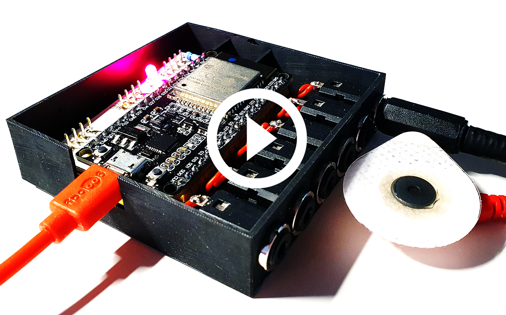

# EMBody: A Data-Centric Toolkit for EMG-Based Interface Prototyping and Experimentation

This repository contains EMBody, a data-centric toolkit for rapid prototyping and experimentation of EMG-based interfaces. You can find the associated publication [here](https://dl.acm.org/doi/10.1145/3457142). Feel free to watch our short teaser video below. You can additionally find a detailed [instructional video](./manual/manual.mp4) as part of the [manual](./manual).

[](https://jakob-karolus.de/publications/karolus21embody.mp4)

## About
EMBody is a toolkit, which is developed at LMU Munich. It is financially supported by the European Union's Horizon 2020 Programme under ERCEA grant no. 683008 AMPLIFY.

The toolkit consists of a hardware prototype that can record electrical potentials (e.g. via surface electrodes), convert these in a digital representation, and stream them over an available WiFi connection. This is complemented by an accompanying [software application](./embody), that receives the signal and provides an interpretation of the data.

EMBody's main use case is recording electromyograms (EMG) via surface electrodes. We envision that the toolkit enables creators to rapidly begin their journey into EMG-based interfaces. This repository contains all the necessary resources to build the system from scratch. Please feel free to contact us in case of questions.

## Hardware ressources
* Circuit board layouts and cases: see [Casing](./casing) and [Circuits](./circuits) for files
* Short assembly description
* Firmware for ESP32 microcontroller: see [Firmware](./esp_firmware)

## Software application
* python application [EMBody](./embody) connecting to the prototype, see the [Manual](./manual) for a detailed operation manual and workflow including the instructional video

## Citing EMBody

Below are the BibTex entries to cite EMBody
```
@article{karolusEmbody2021,
author = {Karolus, Jakob and Kiss, Francisco and Eckerth, Caroline and Viot, Nicolas and Bachmann, Felix and Schmidt, Albrecht and Wo\'{z}niak, Pawe\l W.},
title = {EMBody: A Data-Centric Toolkit for EMG-Based Interface Prototyping and Experimentation},
year = {2021},
issue_date = {June 2021},
publisher = {Association for Computing Machinery},
address = {New York, NY, USA},
volume = {5},
number = {EICS},
doi = {10.1145/3457142},
url = {https://github.com/HCUM/embody},
journal = {Proc. ACM Hum.-Comput. Interact.},
month = may,
articleno = {195},
numpages = {29}
}
```
