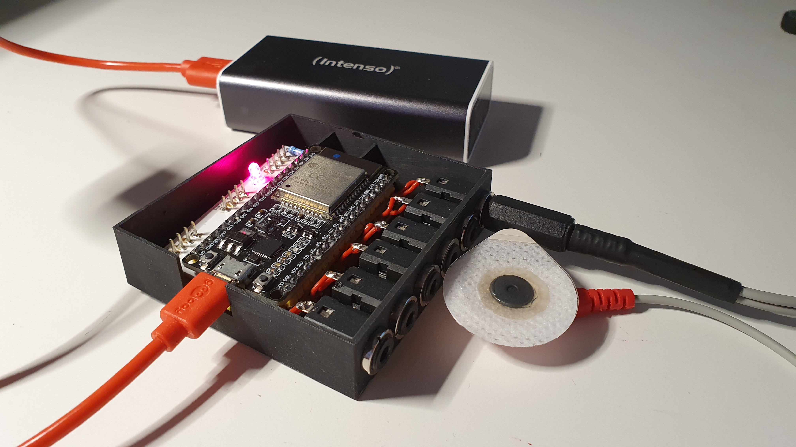
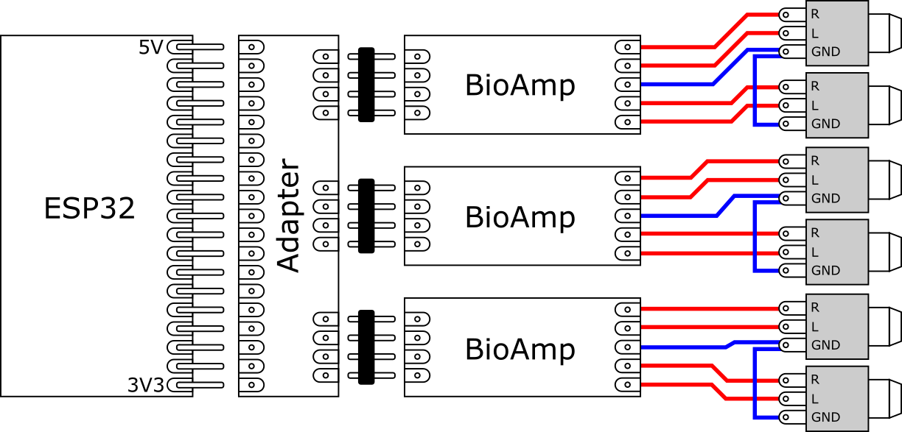
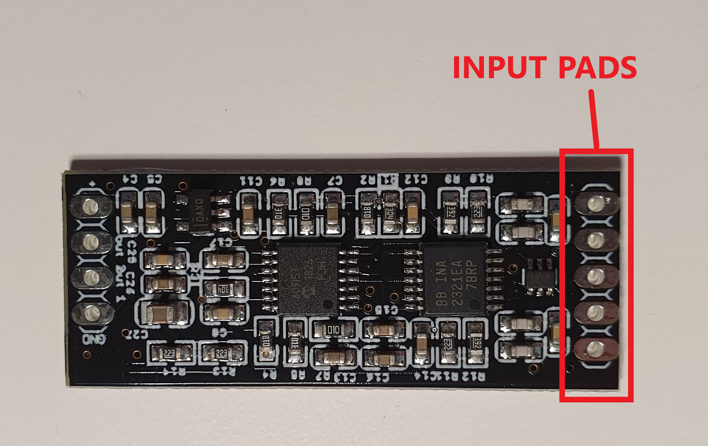
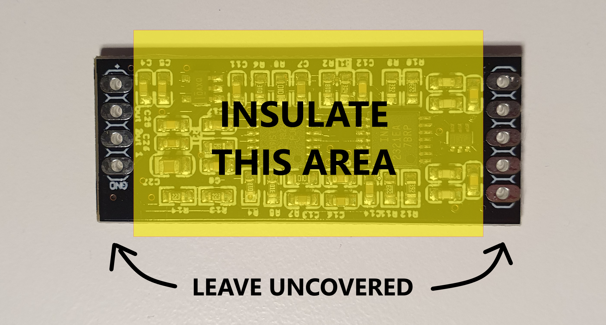
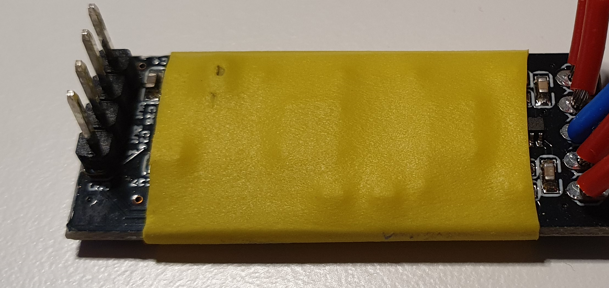
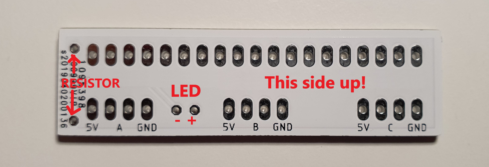
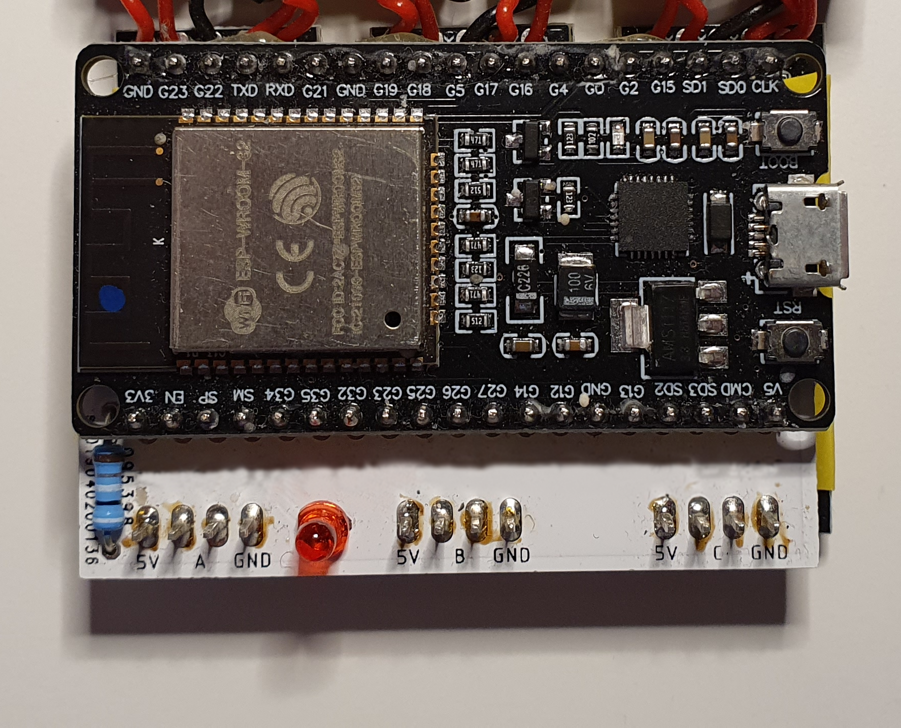

# Circuit files
## INA2321Bioamp_2018-10-30.zip
Gerber files for adapted bio amplifier (see https://github.com/BigCorvus/2-Channel-Biopotential-Amp) and corresponding bom list.
## adapter19to3x4_v3_2020-05-04.zip
Gerber files for custom adapter board connecting three amplifiers to a ESP-32 microcontroller.

# Hardware Assembly Instruction

## General connection diagram

This is the general diagram of the hardware.

Follow the instructions below for a guided assembly tutorial.

## How to assemble the EMG hardware
The process is easy and requires minimal skills.
You will need the following tools:

* Soldering iron
* Solder
* Tweezers
* Wire-cutter
* Permanent marker

And the following components:

* ESP32 board x 1
* Bioamplifier x 3
* Adapter board x 1
* Insulated copper wire
* Heat shrink tubing (14mm) 
* LED 5 mm x 1
* 100 Ohm axial resistor x 1
* Header with 4 pins x 3
* Stereo female audio jacks (3.5mm) x 6 - [This model](http://www.farnell.com/datasheets/2645331.pdf) fits in the 3D case
* 3D printed case

### Step 1: solder cables to Bioamplifier board
Cut pieces of cable around 5 cm long, peel one end, and solder them to the five pads on the input side of the Bioamplifier (marked in the image below). The cables should come out on the upper side of the board. Repeat for all Bioamplifier boards.

### Step 2: insulate the Bioamplifier board
Insert the board through a piece of heat shrink tube of adequate length to cover the components but leaving the pads free. Alternatively, use electrical tape if heat shrink tube is not available. Repeat for all Bioamplifier boards.

### Step 3: solder headers to Bioamplifier board
Solder the 4-pin headers on the upper side of the board, as shown in the image below. Repeat for all Bioamplifier boards. 

### Step 3: solder resistor and LED to Adapter board
Solder the resistor on the upper side of the board, as shown in the picture. Solder the LED on the same side. Remove the protruding pins on the opposite side.

### Step 4: solder ESP32 to Adapter board
Solder the 19 pins of the left side of the ESP32 to the Adapter board (see left image from step 5).

### Step 5: solder Bioamplifiers to the Adapter board
Solder all Bioamplifiers to the Adapter board. The Adapter board should face up, on top of the Bioamplifiers. 

|||

### Step 6: solder connectors
Position the boards and the audio connectors in the 3D-printed case, and use a permanent marker to mark the length of the wires where they touch the corresponding pad of the connector (use as reference the image from Step 7).
Remove all parts from the case. Cut and peel the cables using the marks as reference. Using additional pieces of wire, solder the ground pin of the audio connectors together in pairs, so you have three pairs of connectors. Solder the cables from the Bioamplifiers to the connectors.

### Step 7: flash and finish
Position the hardware in the case, as shown in the image below.
Close the case. The device is ready to flash! 

