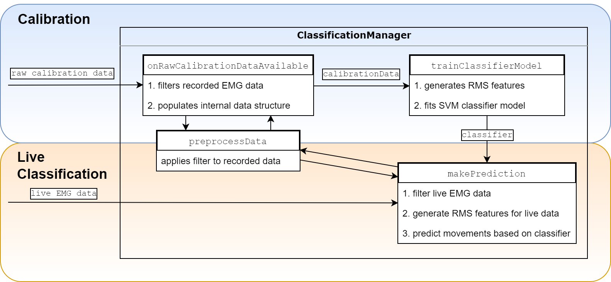

# EMBody software application

**For a complete manual on EMBody's workflow, please refer to /manual/Readme.md.**

Run "python logic/Main.py" to start the application. This software is based on Python 3.6 and the following libraries: 
* wxPython
* matplotlib
* pandas
* numpy
* scipy
* sklearn
* pylsl

It provides a GUI split into different views, that interact with each other: Setup, Calibration and Liveview, as well as a logic backend for stream and classification handling, communicating over StreamEvents.
Note that developers can provide additional functionality by adding more views or substituting stream handling (StreamHandler.py). Of special interest in this case should also be the ClassificationManager.py handling classification for the incoming signal.
Developers are encouraged to change preprocessing, feature generation and classification algorithms if needed.

## Overview of EMBody's classification pipeline
Please refer to the paper and source code for additional information.

