# EMBody: An Integrated Toolkit for EMG-Based Interface Prototyping

This manuals describe how to use the software toolkit to connect to an existing EMBody prototype and interpret the signal.
The software is based on Python 3.6 and the following libraries: wxPython, matplotlib, pandas, numpy, scipy, sklearn, pylsl (also refer to [EMBody Software](./embody)).
It provides a GUI split into different views, that interact with each other: Setup, Calibration and Liveview, as well as a logic backend for stream and classification handling, communicating over StreamEvents. Note that developers can provide additional functionality by adding more views or substituting stream handling (StreamHandler.py). Of special interest in this case should also be the ClassificationManager.py handling classification for the incoming signal. Developers are encouraged to change preprocessing, feature generation and classification algorithms if needed.
Details on hook methods and their purpose can be found in the paper (an overview is provided at [EMBody Software](./embody)).

EMBody already provides out-of-the-box functionality to calibrate and predict gestures recorded via EMG signals. This section outlines a typical workflow and gives detailed instructions for the individual views of the toolkit. The following video provides the same step by step guide for this workflow.

[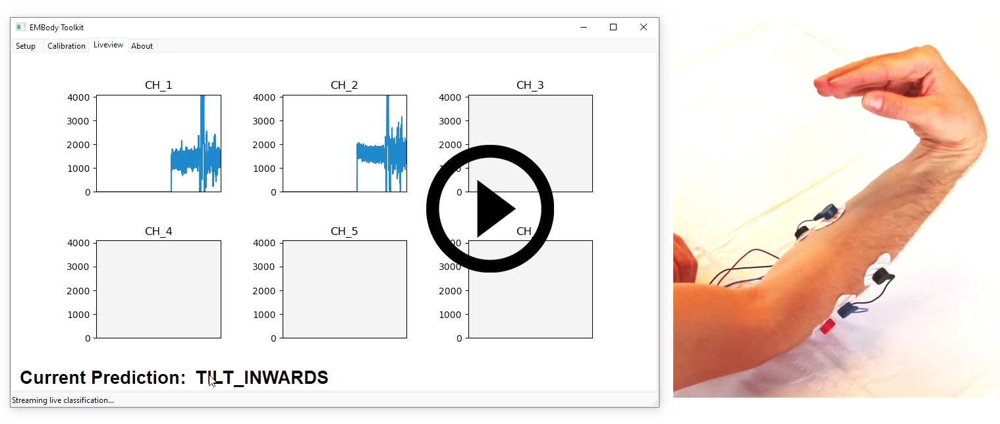](https://jakob-karolus.de/videos/embody_manual.mp4)

## Standard Workflow
1. Set-up prototype and connect electrodes, see **Electrode Setup**.
2. Connect to prototype via **Connection Setup**. Select active channels and hit calibrate.
3. Provide a list of gestures/movements to recognize in **Calibration**.
4. Run a complete calibration providing sample data for each gesture.
5. Train a classifier model.
6. Start live classification, enabling a UDP stream (port: 3334) of live predictions (alternatively: pylsl).
7. Connect to the live classification stream with any other application and use for interaction.

## Electrode Setup
The EMBody prototype uses a bipolar sensing technique (two sensing electrodes, one GND/REF electrode) to reduce noise artifacts. Identify suitable muscle groups to record first (also see the EMBody video).
Place the GND electrode nearby, but on a non-involved area (e.g. close to bones or on fat tissue). For forearm recordings, a position close (but not on the elbow, due to movement artifacts) is advised.
Eventually, place the two sensing electrodes over the muscle belly that you are interested in. Repeat these steps for any muscle (group) required (EMBody supports up to six channels).

| 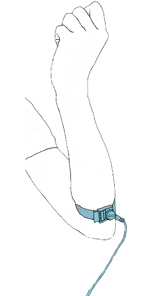 | 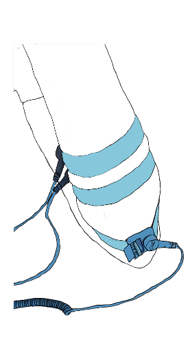 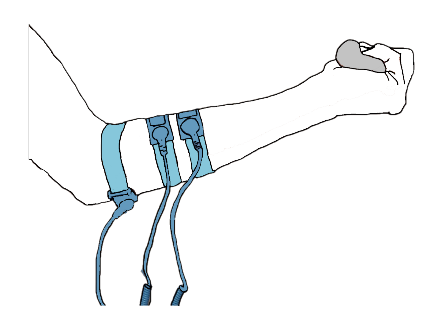| 
|:--:|:--:| 
| *Connecting GND electrode* | *Connecting sensing electrodes* |

### General guidelines for electrode placement
* Place the GND/REF electrode close by, but on uninvolved tissue. Bones and fat tissue are good candidates.
* For bipolar measurements, noise is cancelled out through differential measurments:
  * Electrodes close together reduces environmental noise (any electromagnetic noise), but also dimishes signal discriminativeness.
  * Likewise, the farther apart the sensing electrodes are, the bigger the noise impact. It also decrease locality of the signal (harder to pinpoint individual muscles).
  * A good trade-off is to cover approx. 50% of the muscle belly with distance between the electrodes.
* Unipolar measurements (one sensing, one ref electrode) are supported as well, as long as the sent out UDP stream adheres to the correct format ("timestamp;CH_1;CH_2;..."). Note that the software can technically handle more than six channels, but only display up to six in the live view.
* The size of the electrode greatly impacts the recorded signal. The effect is similar to changing amplifier gain.
  * Small diameter electrodes can provide a more localized signal, but provide a smaller amplitude.
  * Bigger diameter "capture more signal", hence provide higher amplitude.

Finally, connect the electrode cables to the hardware prototype and power it, e.g. via a powerbank. Be sure to configure its Wi-Fi settings in advance (see next section).

| 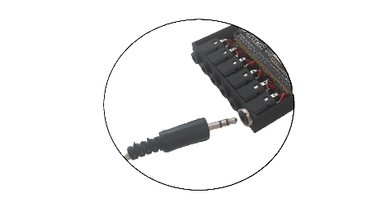 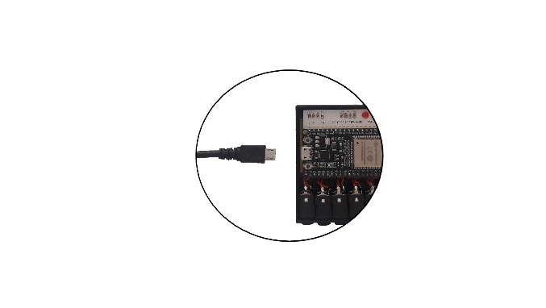 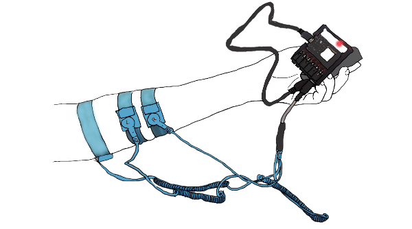| 
|:--:|
| *Connecting electrode cables and power* |

### Wi-Fi Setup (once)
The standard firmware implements a config portal for Wi-Fi settings.
If no SSID was previously registered, the config portal boots up automatically. Connect to the SSID "EMG_xxx" (where xxx is the Chip ID of your microcontroller) and use "emg" as password.
Navigate to "192.168.4.1" and configure Wi-Fi settings. On subsequent boot-ups, the microcontroller will try to connect to the provided configuration (Config portal boot can be forced by pressing the BOOT button).

## Connection Setup
After starting the EMBody software application (make sure to install required python packages, e.g. via "pip install <package_name>"), you can connect to the prototype (or any other UDP stream, see above) via the Setup tab.
The setup tab specifies connection properties, like UDP address/port and channels to use. It includes a testing mechanism for given UDP connections. If the prototype and the receiving computer are on the same network a blank address (corresponding to "**0.0.0.0**") is sufficient. Note that the prototype uses **port 3333** by default.
After specifying a connection and succesfully testing it, the toolkit provides information about detected channels and an estimated sampling rate. 

| 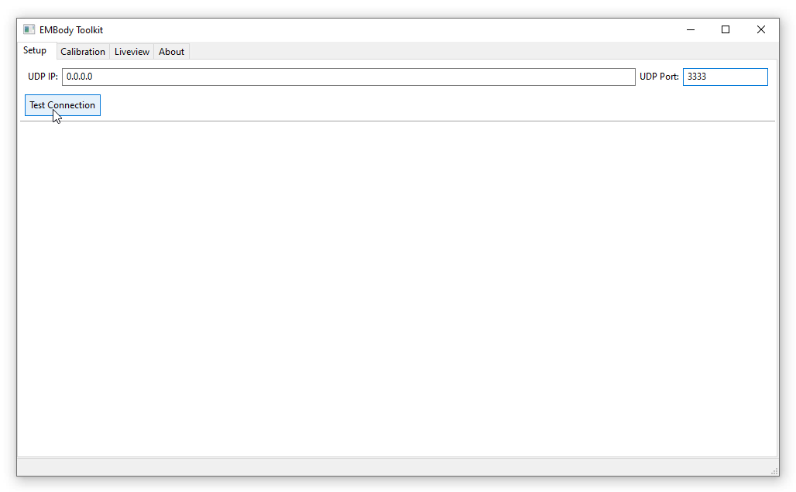 | 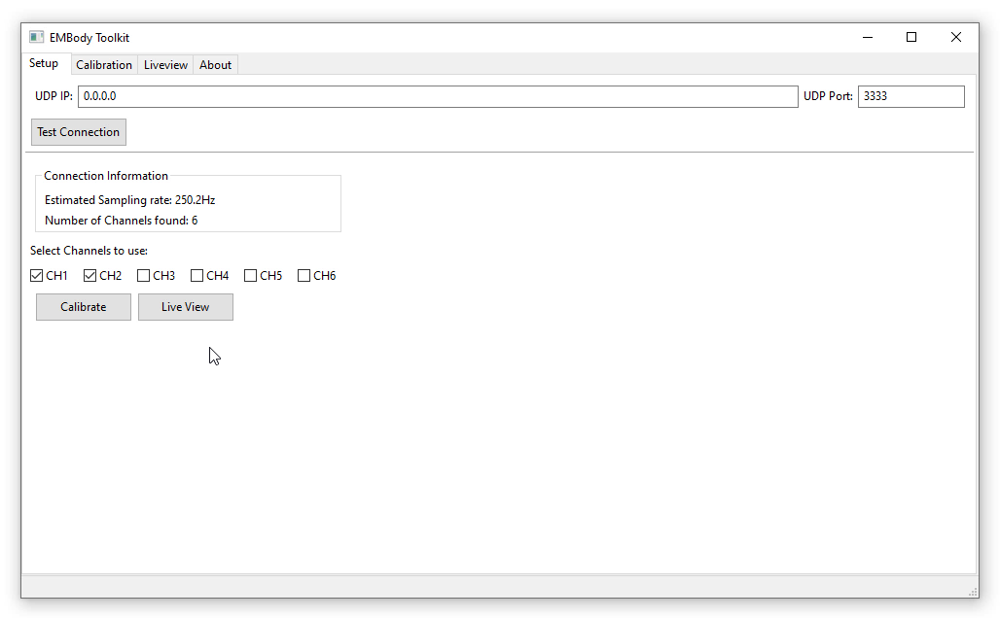 | 
|:--:|:--:|
| *Specifying connection* | *Checking connection info and selecting channels* |

If you are using a custom prototype sending UDP packages, make sure to adhere to the protocol (or adapt the StreamHandler.py). Note that the algorithm expects a timestamp channel on the first position, followed by data channels: timestamp;CH_1;CH_2;....
Aferwards, users can decide which channels to activate and either jump to the calibration procedure (**Calibration**) or just display the signal in the live view (**Liveview**).

## Calibration
To recognize and predict performed gestures, the users needs to provide the toolkit with exemplary data for each to-be-recognized gesture (calibration label) or movement. Note that the toolkit performs best for static gestures (e.g., forming a fist, tilting the hand left/right). On the left side, you may provide one calibration label per line (a null class is automatically added) or load/save an existing list of labels (icon top left). *Create Calibration* will construct an empty datastructure (on the right side) showing you for which labels you will calibrate for.

| 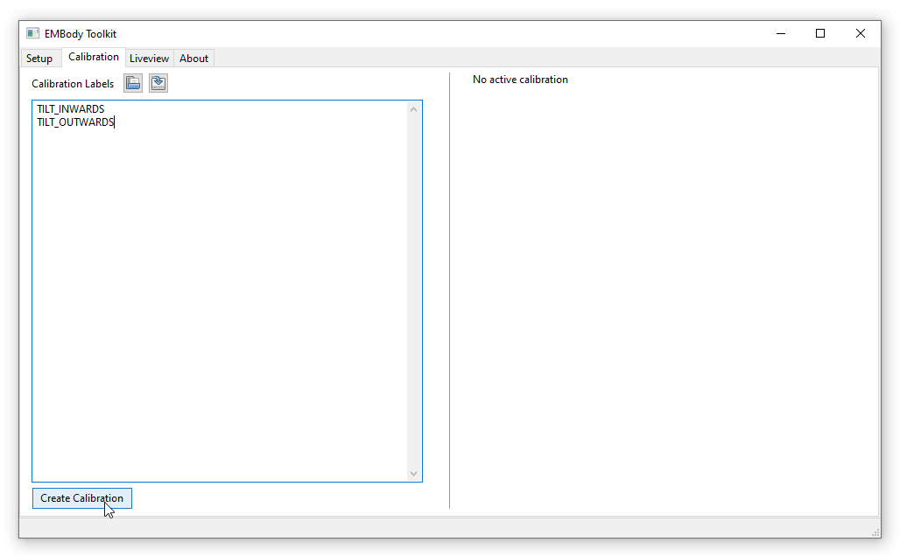 | 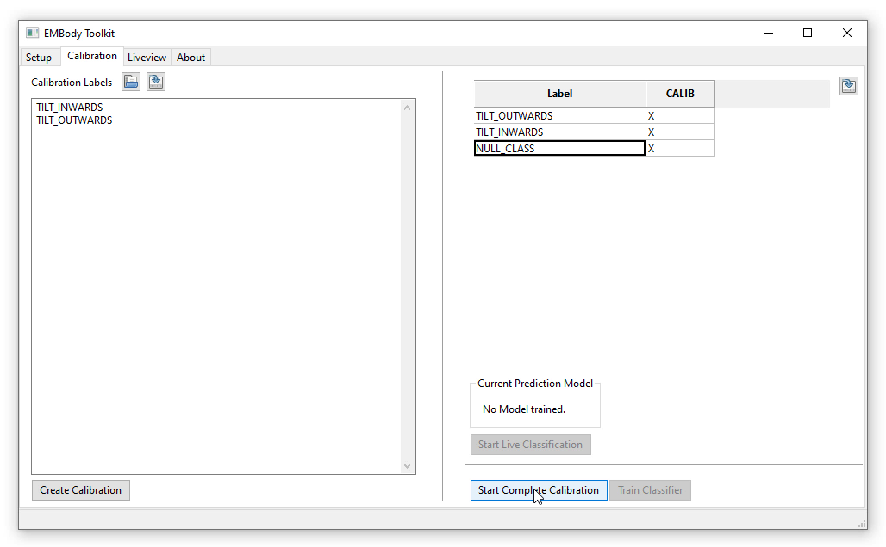 | 
|:--:|:--:|
| *Specifying calibration labels* | *Creating an empty calibration (right side)* |

*Start Complete Calibration* will guide you through a full calibration process, where you will alternatingly provide sample data for the labels. After the process completes, the toolkit displays the amount of collected data (in seconds) for each label and allows the user to train a classification. Depending on the size of collected data, this might take a while and happens in the background. After completion, the software will perform a 10-fold cross validation on the learned model to indicate its performance. Upon succesfully training a model, the user can start a live classification (the current model used will be displayed in the calibration tab). The live classification is available in the **Liveview** tab as well as will be streamed via UDP (**port: 3334**), thus being available to any other software in the network. The port can be specified (not shown in the picture). Alternatively, EMBody provides streaming over lab streaming layer (LSL) as well, see pylsl. Note that at any point you can save a recorded calibration for post-hoc analysis (top right), e.g., running different classification schemes.

| 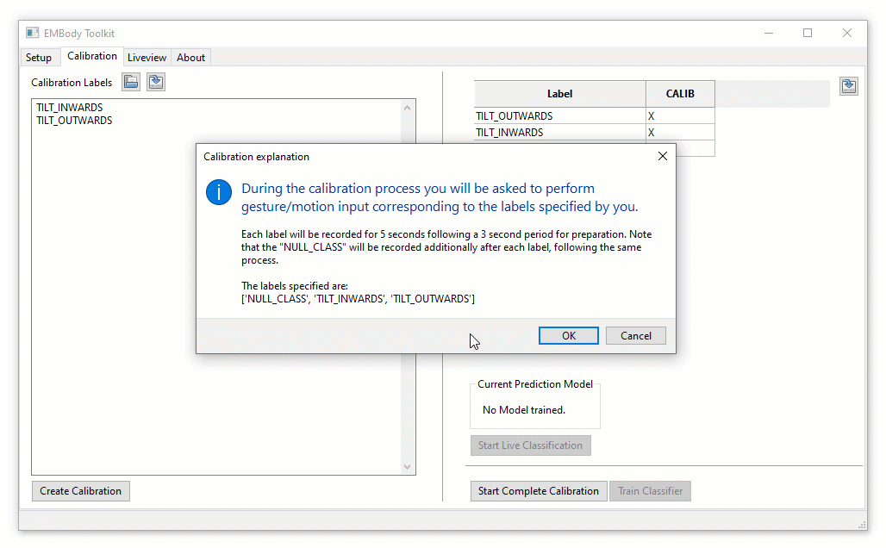 | 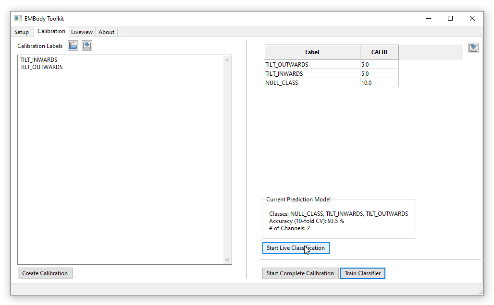 | 
|:--:|:--:|
| *Wizard during calibration* | *After training a classifier (model information on bottom right)* |

## Liveview
This view will display the live signal coming from the prototype (upon connecting to it). Note that it will mimick the selected active channels in the **Setup** tab. If a trained model is available and live classification is active, this tab will also display the currently detected gesture.

|   | 
|:--:|
| *Liveview of channels 1 and 2, including live classification for incoming EMG data* |
